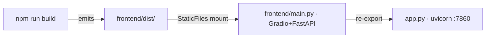

# HF Rubic Instructor

Rubic's Cube Instructor, built on Gradio and small instruct Language Model

Command List:

The architecture matters because the two halves are coupled: the TypeScript/Three.js frontend (in frontend) gets built by Vite into `frontend/dist/`, and the Python/Gradio app (`main.py`, re-exported by `app.py`) serves that built bundle. So you must build the frontend before running Gradio — Gradio reads `dist/index.html` at startup and shows an error panel if it's missing.



Frontend: npm/npx (typescript + three.js)

```bash
cd frontend
npm install          # once, installs three, vite, vitest, typescript

npm run dev          # vite dev server → http://localhost:5173
# Best for iterating on the cube UI quickly. Note: vite.config.ts sets base: '/cube-assets/', so the dev URL is http://localhost:5173/cube-assets/.

npm run build        # tsc --noEmit (typecheck) + vite build → frontend/dist/

npm run preview      # serves frontend/dist/

npx vitest run        # same as npm test
npx tsc --noEmit      # typecheck only
npx vite build        # build only

npm test                              # vitest run — full suite once
npx vitest                            # watch mode (re-runs on file changes)
npx vitest run cubelets.test.ts       # just the cubelet rotation tests
npx vitest run --coverage             # with coverage (needs @vitest/coverage-v8)
```

Gradio/python

```bash
python -m venv .venv
source .venv/bin/activate
pip install -r requirements.txt      # gradio, fastapi, uvicorn

python app.py                        # → http://0.0.0.0:7860
uvicorn app:app --host 0.0.0.0 --port 7860 --reload   # auto-reload on Python changes
uvicorn frontend.main:app --port 7860                 # the underlying app directly
```

Typical End to end loop

```bash
# Terminal A — build/iterate frontend
cd frontend && npm install && npm run build

# Terminal B — run the Gradio app (repo root, venv active)
pip install -r requirements.txt
python app.py        # open http://localhost:7860
```
